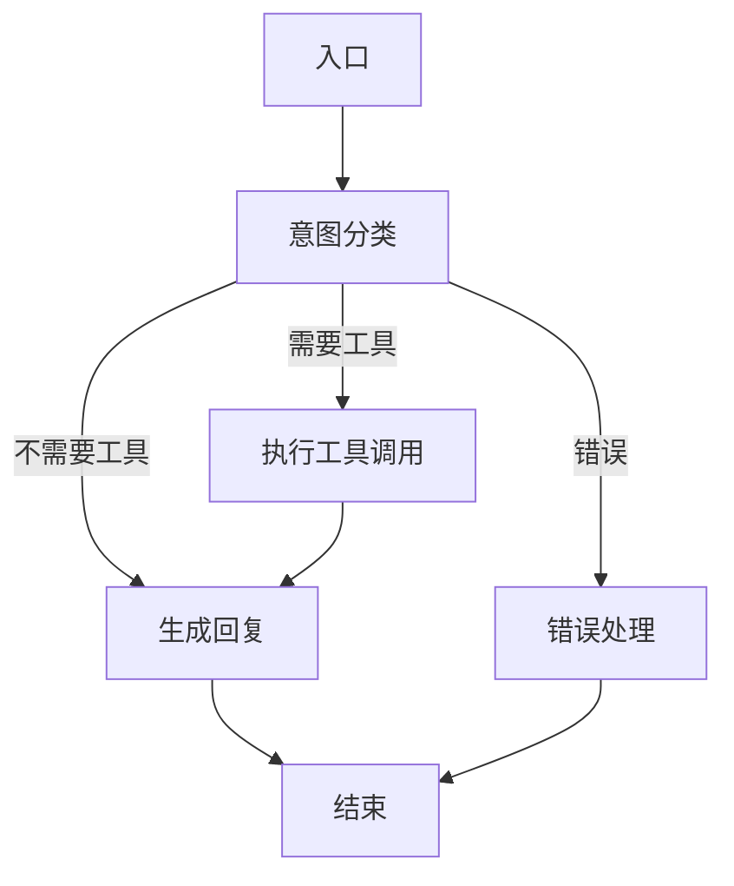

# AI Agent 模块 (LangGraph)

基于 LangGraph 构建的有状态 AI Agent 编排层，是 PawLife AI Native 设计的核心。

## 架构设计

遵循 CLAUDE.md 中的架构原则：

```
意图识别 → 上下文注入 → 工具调用 → 结果整合 → 流式回复
```

### 工作流图



### 目录结构

```
services/agent/
├── __init__.py   # 模块导出
├── README.md     # 本文档
├── state.py      # 状态定义
├── tools.py      # 工具集合（所有工具在这里注册）
├── nodes.py      # 工作流节点实现
├── graph.py      # LangGraph 图组装
└── runner.py     # 运行入口（供上层 API 调用）
```

## 核心组件

### AgentState (`state.py`)

使用 `TypedDict` 定义 LangGraph 工作流中的状态：

```python
class AgentState(TypedDict):
    user_id: UUID                    # 用户 ID
    pet_id: Optional[UUID]           # 当前活跃宠物 ID
    session_id: str                  # 会话 ID
    messages: List[AIMessage]        # 消息历史
    current_input: str               # 当前用户输入
    input_type: str                  # 输入类型 (text/voice/image)
    input_url: Optional[str]         # 语音/图片 URL

    intent: Optional[str]            # 意图分类结果
    intent_confidence: Optional[float]
    needs_tool_call: bool            # 是否需要工具调用
    tool_calls: Optional[List[...]]  # 工具调用列表
    tool_outputs: Optional[List[...]] # 工具调用输出

    response_content: Optional[str]  # 最终回复
    suggestions: Optional[List[str]] # 建议问题

    stream_callback: Optional[Any]   # 流式输出回调
    error: Optional[str]             # 错误信息
```

### 工具列表 (`tools.py`)

所有工具遵循 LangChain `BaseTool` 接口，完整工具列表：

| 工具名称 | 功能描述 | 状态 |
|---------|---------|------|
| `get_pet_profile` | 获取宠物档案 | ✅ 已实现 |
| `create_pet_profile` | 创建宠物档案 | ✅ 已实现 |
| `update_pet_profile` | 更新宠物档案 | ✅ 已实现 |
| `switch_active_pet` | 切换活跃宠物 | ✅ 已实现 |
| `log_meal` | 记录饮食 | ✅ 已实现 |
| `log_activity` | 记录运动 | ✅ 已实现 |
| `log_weight` | 记录体重 | ✅ 已实现 |
| `calculate_nutrition` | 计算营养成分 | ✅ 已实现（查询营养数据库） |
| `evaluate_diet_vs_needs` | 对比 AAFCO 标准评估 | ✅ 已实现 |
| `generate_recipe` | 生成个性化食谱 | ✅ 已实现（LLM + 营养数据库） |
| `recognize_food_image` | 识别图片中的食物 | ✅ 已实现（GPT-4o Vision） |
| `transcribe_voice` | 语音转文字 | ✅ 已实现（Whisper API） |
| `search_nearby_hospital` | 搜索附近宠物医院 | ✅ 已实现（腾讯地图 API） |
| `web_search` | 联网搜索信息 | ✅ 已实现（DuckDuckGo） |
| `schedule_reminder` | 设置定时提醒 | ✅ 已实现 |
| `generate_health_report` | 生成健康报告 | ✅ 已实现（LLM + 数据聚合） |

所有工具均已实现 `_arun` 异步方法，通过 `TOOL_REGISTRY` 字典按名称索引。

### 节点 (`nodes.py`)

- **classify_intent**: 使用 LLM 对用户输入做意图分类，判断是否需要调用工具
- **should_use_tools**: 条件边判断函数，决定下一个节点
- **call_tools**: 根据意图执行工具调用，支持多工具顺序执行
- **generate_response**: 整合上下文和工具结果生成最终回复，**支持流式输出**
- **handle_error**: 统一错误处理，生成友好错误回复

### 运行入口 (`runner.py`)

提供三种运行方式：

```python
# 1. 非流式推理（完整响应一次性返回）
response = await run_agent(
    user_id=user_id,
    session_id=session_id,
    message=message,
    pet_id=pet_id,
    message_type="text",
    input_url=None,
    history=None,
)
# -> 返回 AIConversationResponse

# 2. 流式推理（逐块返回，用于 SSE）
async for chunk in run_agent_streaming(...):
    # 每个 chunk 是一段文本
    yield chunk

# 3. 获取完整最终状态（调试用）
final_state = await get_final_state(...)
```

## 使用示例

### 在 FastAPI 路由中使用

**非流式端点：**

```python
from services.agent import run_agent

@router.post("/conversation")
async def conversation(
    request: AIConversationRequest = Body(...),
    user: User = Depends(get_current_user),
):
    response = await run_agent(
        user_id=user.id,
        session_id=request.session_id or str(uuid4()),
        message=request.message,
        pet_id=request.pet_id,
        message_type=request.message_type,
        input_url=request.image_url or request.voice_url,
    )
    return response
```

**流式端点 (SSE)：**

```python
from fastapi.responses import StreamingResponse
from services.agent import run_agent_streaming

@router.get("/conversation/stream")
async def conversation_stream(
    message: str,
    session_id: Optional[str] = None,
    pet_id: Optional[UUID] = None,
    user: User = Depends(get_current_user),
):
    return StreamingResponse(
        run_agent_streaming(
            user_id=user.id,
            session_id=session_id or str(uuid4()),
            message=message,
            pet_id=pet_id,
        ),
        media_type="text/event-stream",
        headers={
            "Cache-Control": "no-cache",
            "Connection": "keep-alive",
        },
    )
```

## 开发指南

### 添加新工具

1. 在 `tools.py` 中：
   - 定义输入参数 `XXXInput` (继承 `BaseModel`)
   - 定义工具类 `XXXTool` (继承 `BaseTool`)
   - 实现 `_run` 和 `_arun` 方法
2. 在 `get_all_tools()` 中添加工具实例
3. 更新本文档的工具列表

### 修改工作流

在 `graph.py` 的 `create_agent_graph()` 中修改节点连接关系。

## 依赖

需要安装：

```
langgraph
langchain
langchain-anthropic
pydantic
```

## 设计原则

1. **AI Native First**: 所有功能通过意图分类触发，AI 主导流程
2. **有状态**: LangGraph 原生支持持久化会话，对话可中断恢复
3. **流式优先**: 所有输出支持流式，提供更好的用户体验
4. **错误可见**: 任何步骤出错都进入统一错误处理节点
